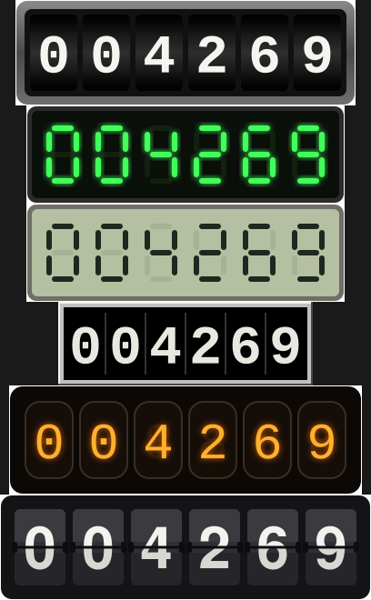

# hit-counter

Retro odometer-style visitor counter, rendered as SVG. Count sourced from a
self-hosted [umami](https://umami.is) Postgres database.

## Usage

```html
/counter.svg" alt="visitor counter" height="58">
```

## Run

```sh
npm install
DATABASE_URL=postgres://... node server.js
```

Without a database: `MOCK_COUNT=4269 node server.js`; add `MOCK_VIEWS="/a/=12,/b=3"` for `/views`.

## Configuration

Environment variables: `DATABASE_URL`, `WEBSITE_ID`, `CACHE_SECONDS` (60),
`MIN_DIGITS` (6), `COUNT_OFFSET` (0), `PORT` (3000). See AGENTS.md for details.

## Styles

Top to bottom: `odometer`, `led`, `lcd`, `strip`, `nixie`, `flip`.



## Endpoints

- `/counter.svg` — the counter image; `?style=` one of `odometer`, `led`, `lcd`, `strip`, `nixie`, `flip`
- `/counter.svg?key=<slug>` — a separate counter that counts its own fetches instead of reading umami. For embeds on pages umami cannot see, like a GitHub README. Keys: `a-z`, `0-9`, `-`.
- `/views` — JSON, every path's pageviews from umami, most viewed first: `[{ "path", "views" }]`; `?limit=` (default 200, max 1000)
- `/views?path=/some/page/` — one path: `{ "path", "views" }`, `0` when umami never saw it. Paths are keyed without a trailing slash. costafotiadis.com reads both for the views count on each post
- `/styles` — HTML gallery of all styles
- `/healthz` — health check

Default style: `COUNTER_STYLE` env var, else `odometer`.
